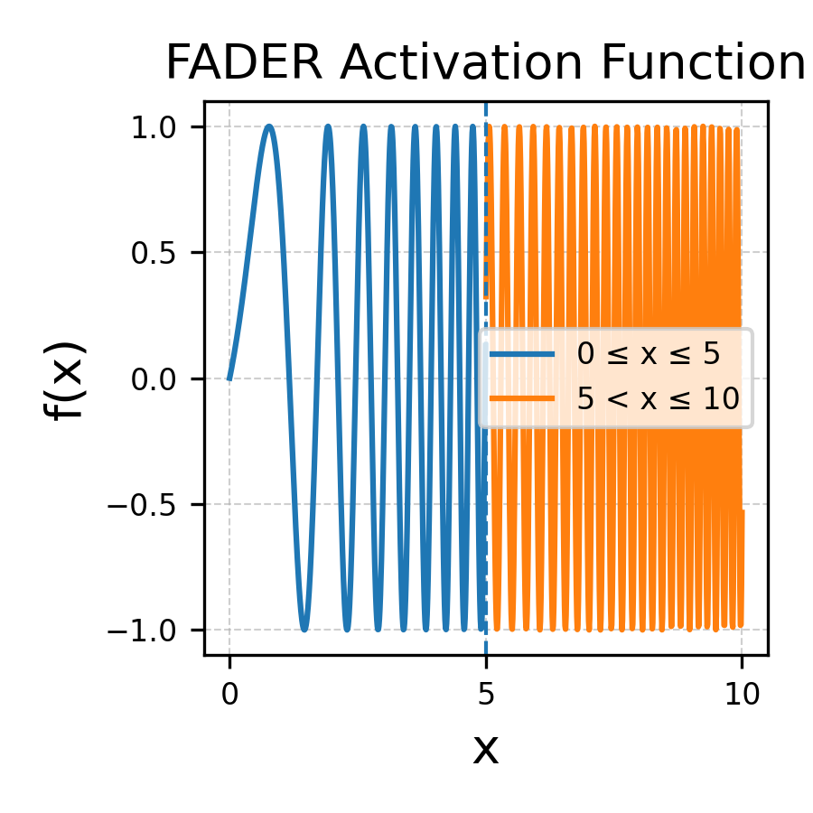

# FADER: Frequency ADaptive implicit nEuRal representations


We introduce a implicit neural representation that allows for flexible tuning of the spectral bias, enhancing signal representation and optimization. 🚀

This repository provides the code for several applications:

* **Image Fitting:** Demonstrates the model's ability to represent 2D images.
* **NeRF Implementation:** Our NeRF experiments are built upon the [**torch-ngp**](https://github.com/ashawkey/torch-ngp) codebase.


<div align=center>

</div>

## Setup
```bash
conda create -n fader python=3.8
conda activate fader
pip install -r requirements.txt
```

## Training

### Image Fitting
```bash
bash run_fader.sh 
# run_finer.sh; run_siren.sh; run_pemlp.sh; run_gauss.sh; run_wire.sh
```

Note - Replace all occurrences of 'siren_1' with 'fader' in the codebase.
